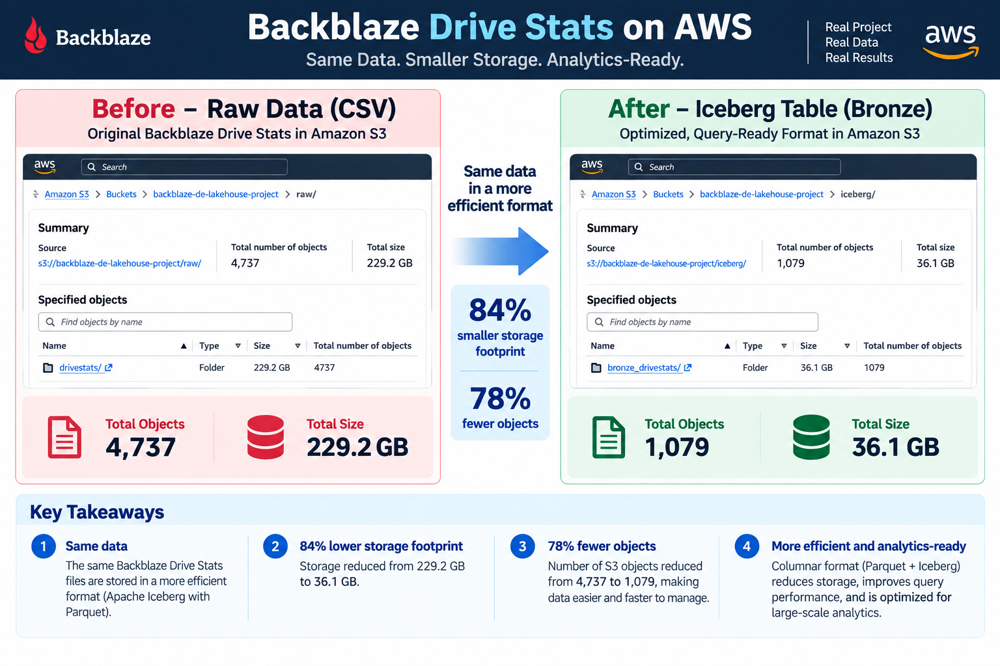
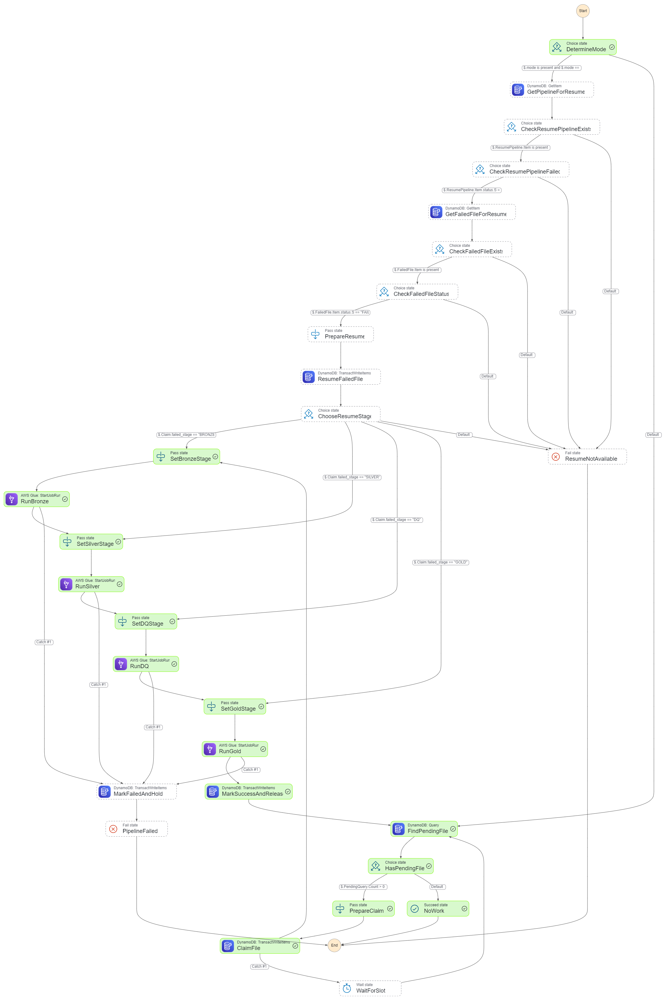
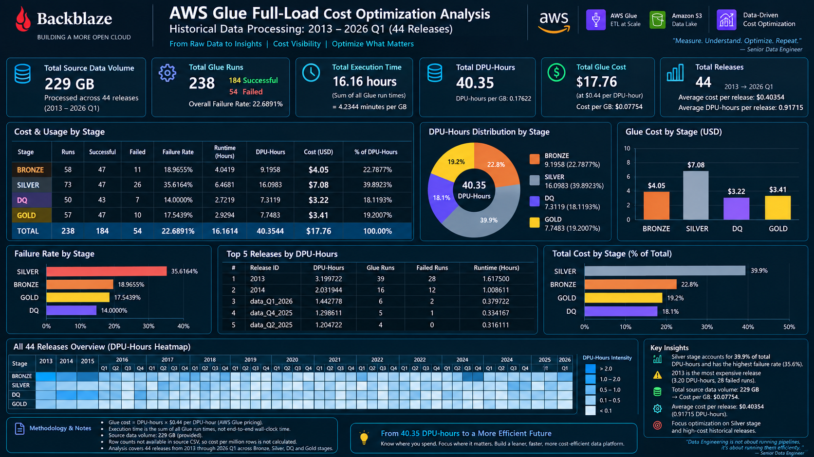

🚀 Backblaze AWS Lakehouse

  
  
  
  
  
  
  

  <b>Production-oriented AWS Lakehouse for Backblaze Drive Stats</b> 
  Event-driven incremental ingestion • Historical backfill • Apache Iceberg • AWS Glue • Step Functions • Lambda • SQS • DynamoDB • Terraform • GitHub Actions

  <a href="DEPLOYMENT.md">Deployment Runbook</a> •
  <a href="architecture/project%20architecture.svg">Architecture SVG</a> •
  <a href="stepfunctions/backblaze_file_processing.asl.json">Step Functions Definition</a>

📌 Project Overview

This repository contains a production-oriented AWS data engineering lakehouse built around the Backblaze Drive Stats dataset.

The project is designed around a real operational problem:

How do we ingest large historical datasets reliably, process them through governed lakehouse layers, and then continue with incremental event-driven ingestion without turning the pipeline into a collection of manually triggered jobs?

The solution separates the platform into two planes:

                    ┌───────────────────────────────┐
                    │         DATA PLANE             │
                    │                               │
Backblaze / files ─► S3 RAW ─► Glue/Spark ─► Iceberg│
                    │        Bronze → Silver → DQ   │
                    │                         → Gold│
                    └───────────────────────────────┘

                    ┌───────────────────────────────┐
                    │        CONTROL PLANE           │
                    │                               │
S3 ObjectCreated ─► SQS ─► Lambda ─► DynamoDB     │
                                      │              │
                                      ▼              │
                                Step Functions       │
                                      │              │
                                      ▼              │
                                Glue orchestration  │
                    └───────────────────────────────┘

The design intentionally keeps data processing separate from orchestration and state management.

📖 About This Project

The project started as a Backblaze Drive Stats lakehouse build and evolved into a more production-oriented platform exercise.

The focus is not simply:

CSV → Spark → table

Instead, the project explores the engineering concerns that appear when a data pipeline becomes a real system:

historical backfills

incremental ingestion

idempotency

schema evolution

data-quality gates

quarantine

transactional lakehouse tables

orchestration state

failure handling

retry and recovery

immutable deployment artifacts

infrastructure as code

CI/CD

least-privilege-oriented IAM

operational evidence

cost awareness

reproducible deployment

The repository therefore contains both the data plane implementation and the platform/deployment layer required to operate it.

🎯 Goals

The main goals of this project are:

Build an AWS-native lakehouse using Apache Iceberg.

Support a controlled historical backfill from the Backblaze Drive Stats releases.

Transition from historical processing to event-driven incremental ingestion.

Preserve source fidelity in Bronze.

Apply canonicalization and schema governance in Silver.

Isolate invalid records through data-quality and quarantine logic.

Produce analytical Gold datasets.

Coordinate file processing with a DynamoDB-backed control plane.

Deploy infrastructure with Terraform.

Deploy Lambda and Glue application code through GitHub Actions and AWS OIDC.

Make failures observable and resumable rather than relying on manual reprocessing.

🏗️ Architecture

Primary Architecture

SVG is used as the primary architecture diagram.

  

Source: architecture/project architecture.svg

PNG fallback:

  

🔄 End-to-End Data Flow

                         HISTORICAL PATH
                         ────────────────

Backblaze Drive Stats
          │
          ▼
     S3 RAW objects
          │
          ▼
      Glue / Spark
          │
          ├──────────────► Bronze Iceberg
          │
          ▼
       Silver Iceberg
          │
          ▼
    Data Quality / DQ
          │
          ▼
        Gold Iceberg
          │
          ▼
      Athena / BI

                         INCREMENTAL PATH
                         ────────────────

New CSV object
     │
     ▼
   S3 RAW
     │
     │ ObjectCreated
     ▼
    SQS
     │
     ▼
   Lambda
     │
     ├── validate event
     ├── parse release/file metadata
     ├── register idempotently
     └── wake orchestration
            │
            ▼
       DynamoDB Control Plane
            │
            ▼
      Step Functions Standard
            │
            ├── Claim file
            │
            ├── Bronze
            │
            ├── Silver
            │
            ├── DQ
            │
            └── Gold
            │
            ▼
       DynamoDB → IDLE/SUCCESS

🧠 Core Design: Data Plane vs Control Plane

Data Plane

The data plane is responsible for moving and transforming data.

S3 RAW
  │
  ▼
Bronze Iceberg
  │
  ▼
Silver Iceberg
  │
  ▼
Data Quality
  │
  ▼
Gold Iceberg

Bronze

Bronze is intentionally simple.

Its job is to preserve the source as faithfully as possible while adding only metadata required for lineage and operational tracking.

Typical metadata includes:

release_id

ingested_at

processing_run_id

The Bronze layer is not where business canonicalization belongs.

Silver

Silver is the controlled source-to-canonical boundary.

Responsibilities include:

canonical schema application

explicit type casting

column mapping

required-field checks

deduplication

schema evolution handling

quarantine of invalid records

deterministic merge behavior

The project uses Apache Iceberg to provide table-level transactional behavior and schema evolution capabilities.

Data Quality

The DQ stage evaluates whether the transformed dataset is acceptable for downstream consumption.

Invalid data is not allowed to silently become Gold data.

Gold

Gold contains analytical structures designed for downstream querying and reporting.

The Gold layer is intentionally downstream of validation so that analytical consumers do not have to understand raw source irregularities.

🎛️ Control Plane

The control plane exists because a reliable data pipeline needs more than compute.

S3 Event
   │
   ▼
SQS
   │
   ▼
Lambda
   │
   ▼
DynamoDB
   │
   ▼
Step Functions
   │
   ▼
Glue

S3

S3 is the durable event source and raw landing zone.

Current RAW convention:

raw/drivestats/

Only the intended CSV object pattern is connected to the event notification path.

SQS

SQS decouples object arrival from pipeline execution.

This gives the system:

buffering

asynchronous processing

retry behavior

dead-letter handling

protection from bursts of incoming events

The production mapping uses a batch size of 1 so that each file can remain an explicit processing unit.

Lambda

Lambda is intentionally thin.

It does not perform large-data processing.

Its responsibilities are:

Receive SQS event
    ↓
Parse S3 event
    ↓
Validate bucket/prefix/object
    ↓
Extract release/file metadata
    ↓
Register FILE#source_file
    ↓
Start Step Functions when required

This keeps compute-intensive work out of Lambda.

DynamoDB

DynamoDB is the control-plane state store.

It tracks:

pipeline state

active processing unit

file state

processing run ID

processing timestamps

queue index information

The control table is used for idempotency and coordination rather than storing analytical data.

Step Functions

Step Functions is responsible for orchestration.

The current state machine is a Standard workflow.

Its major responsibilities are:

Determine execution mode
       ↓
Find / claim pending file
       ↓
Run Bronze
       ↓
Run Silver
       ↓
Run DQ
       ↓
Run Gold
       ↓
Mark success / release

It also contains explicit failure and resume paths.

🔀 Two Processing Modes

The system intentionally separates historical backfill from event-driven incremental ingestion.

Mode 1 — Historical Backfill

Historical processing is release-scoped.

Example:

--release_id data_Q1_2026

The full-load Glue jobs are:

bronze_ingestion
silver_cleaned
data_quality_check
gold_layer

Historical processing is deliberately manual and controlled.

Terraform does not launch the 229 GB historical backfill.

Infrastructure provisioning and data backfill remain separate concerns.

Mode 2 — Event-Driven Incremental Processing

Every newly arriving CSV becomes a processing unit.

The incremental Glue jobs are:

bronze_layer
silver_layer
data_quality_layer
gold_analytics_layer

Bronze and Silver receive the actual file path:

--input_path
--release_id

Gold receives the release identifier:

--release_id

The event-driven model therefore follows:

one object
   ↓
one event
   ↓
one registered processing unit
   ↓
one orchestration run

There is deliberately no expected-next-date rule.

The system reacts to what actually arrives.

🔐 Idempotency and Processing Semantics

A central engineering goal of the project is:

A duplicate event must not become duplicate processing.

The Lambda registration path is therefore conditional and duplicate-safe.

The control plane maintains a file identity such as:

FILE#s3://.../raw/drivestats/...

This allows duplicate S3/SQS delivery to be recognized without blindly starting another processing unit.

The design also uses an explicit pipeline control record:

PIPELINE#BACKBLAZE

to coordinate active processing.

The intended invariant is:

At most one active processing unit
per pipeline control lock.

🧬 Schema Evolution

Historical source releases do not necessarily remain identical forever.

The project therefore separates:

Source schema
     ↓
Bronze preservation
     ↓
Canonical schema
     ↓
Silver governance

Bronze preserves new source columns rather than forcing an artificial canonical schema too early.

Silver becomes the controlled compatibility boundary.

Schema definitions are maintained under:

schemas/

This design makes historical and future releases possible without rewriting the entire ingestion layer.

🧪 Data Quality and Quarantine

Data quality is not treated as an optional afterthought.

The project uses explicit checks and quarantine behavior to prevent bad records from automatically becoming analytical data.

Representative concerns include:

missing required fields

malformed values

invalid types

duplicate records

schema mismatch

unexpected source structure

The goal is:

Bad record
    ↓
Quarantine / DQ outcome
    ↓
Investigate

rather than:

Bad record
    ↓
Gold table
    ↓
Business discovers problem later

🧊 Apache Iceberg

Apache Iceberg is the table format used for the lakehouse layers.

The project uses Iceberg because the lakehouse requires capabilities such as:

ACID-style transactional table operations

snapshots

schema evolution

partition evolution

time travel

table-level metadata management

The table format and storage layer are deliberately separated:

Object storage
     ↓
Amazon S3
     ↓
Apache Iceberg tables

Visual reference:

  

File name above follows the current repository naming shown in the project structure. Keep the repository filename unchanged unless it is intentionally renamed.

🪜 Lakehouse Layers

┌─────────────────────────────────────────────────────────┐
│                         GOLD                            │
│      Analytical tables / business-ready datasets       │
├─────────────────────────────────────────────────────────┤
│                          DQ                             │
│      Quality checks / quarantine / acceptance           │
├─────────────────────────────────────────────────────────┤
│                        SILVER                           │
│ Canonical schema / casting / deduplication / evolution │
├─────────────────────────────────────────────────────────┤
│                        BRONZE                           │
│        Source-oriented / lineage / ingestion           │
├─────────────────────────────────────────────────────────┤
│                         RAW                             │
│              Immutable source landing zone              │
└─────────────────────────────────────────────────────────┘

Each layer has a different responsibility.

The design avoids pushing every concern into every layer.

⚙️ AWS Glue Compute

The project uses AWS Glue with Spark for distributed processing.

The repository currently contains two operational job families.

Full-load jobs

Job

Responsibility

bronze_ingestion

Historical Bronze ingestion

silver_cleaned

Historical Silver canonicalization

data_quality_check

Historical DQ

gold_layer

Historical Gold build

Incremental jobs

Job

Responsibility

bronze_layer

File-scoped Bronze ingestion

silver_layer

File-scoped Silver processing

data_quality_layer

Incremental DQ

gold_analytics_layer

Incremental Gold

The deployed job configurations are managed by Terraform, while the application scripts are released through GitHub Actions.

This produces a clean ownership boundary:

Terraform
   ↓
Glue infrastructure

GitHub Actions
   ↓
Glue application script

☁️ Infrastructure as Code

Terraform manages the AWS infrastructure required by the platform.

The main Terraform environment is:

terraform/environments/dev/

Managed areas include:

S3
SQS
DynamoDB
Lambda
Lambda event source mapping
Step Functions
SNS
IAM
GitHub OIDC
Glue jobs
deployment artifact storage

Terraform uses a remote state backend rather than storing state in the Git repository.

🔁 CI/CD

Application code deployment is separate from infrastructure deployment.

Terraform

Terraform owns infrastructure.

terraform plan
     ↓
review
     ↓
terraform apply

GitHub Actions

GitHub Actions owns application releases.

Two main workflows are used:

.github/workflows/deploy-lambda.yml
.github/workflows/deploy-glue.yml

The deployment model uses GitHub OIDC instead of long-lived AWS access keys.

Lambda release flow

Checkout
   ↓
Validate Python
   ↓
Assume AWS role with OIDC
   ↓
Build ZIP
   ↓
Upload immutable artifact
   ↓
Deploy published Lambda version
   ↓
Verify checksum/configuration

Glue release flow

Checkout
   ↓
Validate 8 Glue scripts
   ↓
Assume AWS role with OIDC
   ↓
Upload immutable script artifacts
   ↓
Read current Glue job definition
   ↓
Preserve runtime configuration
   ↓
Update ScriptLocation only
   ↓
Verify all 8 jobs

Deployment artifacts are stored using commit/run-oriented paths so releases are traceable and rollback-friendly.

📸 Architecture and Operational Evidence

Step Functions Graph

  

QuickSight Dashboard

  

Cost Analysis

  

These visuals are kept in the repository so the README documents both the architecture and the resulting engineering artifacts.

📁 Repository Structure

backblaze-aws-lakehouse/
│
├── .github/
│   └── workflows/
│       ├── deploy-lambda.yml
│       └── deploy-glue.yml
│
├── architecture/
│   ├── project architecture.svg
│   ├── project architecture.png
│   └── stepfunctions_graph.png
│
├── dashboard/
│   └── QuickSight.png
│
├── deployment/
│   └── inventory/
│
├── docs/
│   ├── cost_analysis.png
│   └── iceberge_table_formate.png
│
├── glue/
│
├── glue_scripts/
│   └── scripts/
│       ├── full-load/
│       └── incremental-load/
│
├── lambda/
│   └── s3_event_handler/
│       └── lambda_function.py
│
├── schemas/
│
├── stepfunctions/
│   └── backblaze_file_processing.asl.json
│
├── terraform/
│   └── environments/
│       └── dev/
│
├── .gitignore
├── DEPLOYMENT.md
└── README.md

🧰 Technology Stack

Technology

Role

Python

Lambda and Glue application code

Apache Spark

Distributed ETL

AWS Glue

Managed Spark execution

Apache Iceberg

Lakehouse table format

Amazon S3

Raw/object storage

Amazon SQS

Event buffering

AWS Lambda

Event validation and orchestration trigger

Amazon DynamoDB

Control-plane state and idempotency

AWS Step Functions

Workflow orchestration

Amazon SNS

Notification layer

AWS IAM

Access control

GitHub Actions

CI/CD

GitHub OIDC

Short-lived AWS authentication

Terraform

Infrastructure as Code

Athena

Lakehouse query access

QuickSight

Visualization

💡 Engineering Principles

The project is intentionally built around a small set of principles.

1. Separate compute from control

Glue processes data.

DynamoDB tracks state.

Step Functions coordinates execution.

Lambda handles events.

2. Preserve the source

Bronze should not become the transformation playground.

3. Make retries safe

Retries must not create duplicate processing.

4. Make deployments reproducible

Infrastructure and application releases should be traceable to source control.

5. Prefer explicit state over assumptions

The system should know which file is:

PENDING
PROCESSING
FAILED
SUCCESS

rather than infer state from filenames or expected arrival dates.

6. Design for failure

A pipeline that works only when everything succeeds is not enough.

🚧 Known Reliability Item

During runtime testing, an externally aborted Step Functions execution left the DynamoDB pipeline control record in PROCESSING.

The observed situation was:

Step Functions execution = ABORTED
Running executions       = 0
SQS                     = empty
DynamoDB pipeline       = PROCESSING

This exposed a genuine orchestration-recovery gap:

An externally aborted execution can bypass the state-machine failure path that normally performs control-plane cleanup.

This is documented separately from the infrastructure deployment.

See:

DEPLOYMENT.md

The important distinction is:

Infrastructure deployment correctness
                ≠
Runtime recovery correctness

The platform was successfully deployed and Terraform reconciled to:

No changes. Your infrastructure matches the configuration.

Runtime reconciliation remains an explicit engineering hardening item.

📊 Current Deployment Verification

The deployment phase has been verified against the AWS environment.

Verified areas include:

Terraform plan                         ✅
Lambda published deployment            ✅
8 Glue job deployments                 ✅
S3 → SQS event notification            ✅
SQS → Lambda event source mapping      ✅
DynamoDB control table                 ✅
Step Functions Standard workflow       ✅
IAM / GitHub OIDC                      ✅
Immutable deployment artifacts         ✅
Git working tree                       ✅

The project is therefore beyond a simple local ETL demonstration.

It contains:

Infrastructure
+
Application code
+
Orchestration
+
Control plane
+
CI/CD
+
Deployment documentation
+
Operational evidence

🧭 What This Project Demonstrates

This project demonstrates practical knowledge of:

AWS lakehouse architecture

Apache Iceberg

Spark on AWS Glue

S3 event-driven ingestion

SQS buffering

Lambda event handling

DynamoDB control-plane design

Step Functions orchestration

historical backfills

incremental file processing

schema evolution

data-quality validation

quarantine

idempotency

immutable application deployment

Terraform

GitHub Actions

AWS OIDC

operational debugging

deployment verification

failure analysis

cost awareness

📚 Project Documentation

Document

Purpose

README.md

Project overview, architecture and reproducibility guide

DEPLOYMENT.md

Deployment runbook and operational verification

architecture/

Architecture diagrams

stepfunctions/

Workflow definition

schemas/

Canonical and governed schema artifacts

glue_scripts/

Full and incremental Spark applications

lambda/

Event-driven Lambda application

terraform/

Infrastructure as Code

🚧 README Part 1

This first part establishes the public-facing project narrative, architecture, engineering model, operational evidence, and repository structure.

The next part will complete the reproducible clone → configure → deploy → test → operate section, including exact prerequisites, AWS bootstrap, Terraform state, GitHub OIDC setup, Lambda/Glue CI/CD, sample data flow, validation commands, rollback, cleanup, and cost controls for a new engineer running the project in their own AWS account.
