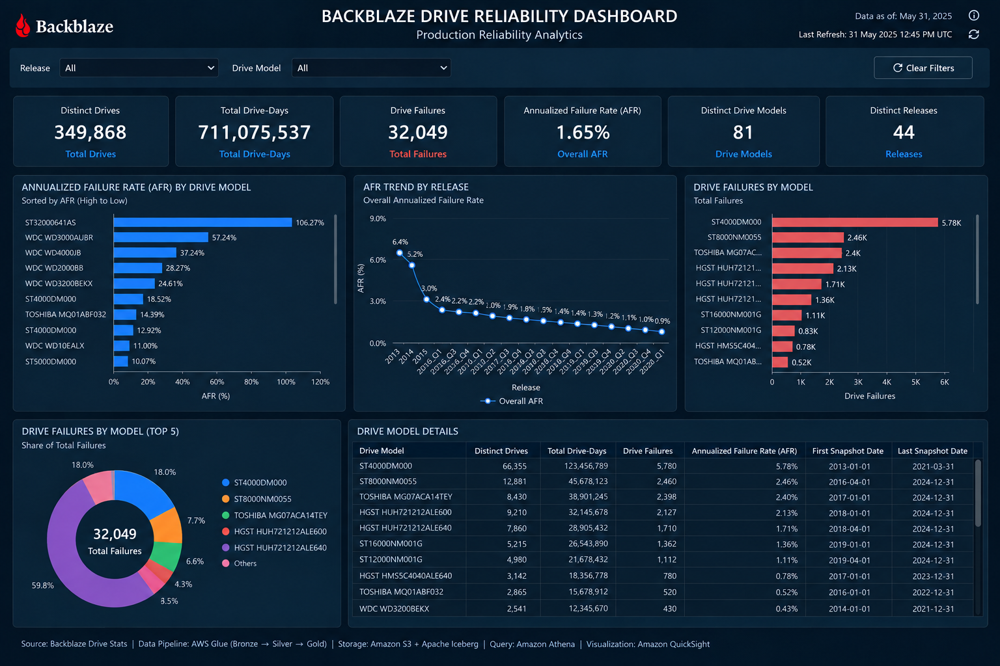

# **BACKBLAZE AWS MODERN DATA LAKEHOUSE PROJECT**

<p align="center">
  <table>
    <tr>
      <td align="center" width="95">
        <br/>
        <sub><b>Backblaze</b></sub>
      </td>
      <td align="center" width="95">
        <br/>
        <sub><b>Python</b></sub>
      </td>
      <td align="center" width="95">
        <br/>
        <sub><b>Apache Spark</b></sub>
      </td>
      <td align="center" width="95">
        <br/>
        <sub><b>Apache Iceberg</b></sub>
      </td>
      <td align="center" width="95">
        <br/>
        <sub><b>AWS</b></sub>
      </td>
      <td align="center" width="95">
        <br/>
        <sub><b>Amazon S3</b></sub>
      </td>
      <td align="center" width="95">
        <br/>
        <sub><b>AWS IAM</b></sub>
      </td>
      <td align="center" width="95">
        <br/>
        <sub><b>GitHub Actions</b></sub>
      </td>
      <td align="center" width="95">
        <br/>
        <sub><b>Terraform</b></sub>
      </td>
    </tr>
  </table>
</p>
<p align="center">
  <b>Production-oriented AWS Lakehouse for Backblaze Drive Stats</b><br/>
  Historical backfill • Event-driven incremental ingestion • Apache Iceberg • AWS Glue • Lambda • SQS • DynamoDB • Step Functions • Terraform • GitHub Actions
</p>

<p align="center">
  <a href="DEPLOYMENT.md">📚 Deployment Runbook</a> •
  <a href="architecture/project architecuture.svg">🏗️ Architecture</a> •
  <a href="dashboard/QuickSight.png">⚙️ Dashboard</a> • 
   <a href="docs/cost_analysis.png">💸 My Cost Analysis of this Project</a>
</p>

---

# 1. 📌 What I Built

I built an AWS-based data lakehouse for the Backblaze Drive Stats dataset.

The project handles two different workloads:

1. Historical data that already exists and needs to be loaded into the lakehouse.
2. New source files that arrive later and need to be processed automatically.

Because these are different problems, I built two processing modes.

```text
HISTORICAL BACKFILL

Backblaze Historical Data
        ↓
     Amazon S3
        ↓
      Bronze
        ↓
      Silver
        ↓
  Data Quality
        ↓
       Gold
```

```text
INCREMENTAL PROCESSING

New Backblaze CSV
        ↓
S3 ObjectCreated Event
        ↓
       SQS
        ↓
      Lambda
        ↓
    DynamoDB
        ↓
  Step Functions
        ↓
   AWS Glue + Spark
        ↓
      Bronze
        ↓
      Silver
        ↓
  Data Quality
        ↓
       Gold
```

The historical pipeline establishes the initial state of the lakehouse.

The incremental pipeline maintains that state when new data arrives.

The current historical processing scope is approximately **229 GB of Backblaze data**.

---

# 2. 🏗️ Overall Architecture

I divided the project into two major parts:

```text
DATA PLANE
→ Processes the actual data
```

```text
CONTROL PLANE
→ Controls the processing workflow and keeps track of processing state
```

The data plane is responsible for moving and transforming data.

The control plane is responsible for deciding what should be processed, controlling the workflow, tracking processing state, and handling failures and resume logic.

The complete system is:

```text
                    CONTROL PLANE
┌─────────────────────────────────────────────────────────┐
│                                                         │
│  S3 Event → SQS → Lambda → DynamoDB → Step Functions  │
│                                              ↓          │
│                                            Glue         │
│                                                         │
└───────────────────────────────────────────┬─────────────┘
                                            │
                                            ↓
                    DATA PLANE
┌─────────────────────────────────────────────────────────┐
│                                                         │
│        S3 RAW → Bronze → Silver → DQ → Gold            │
│                                                         │
└─────────────────────────────────────────────────────────┘
```

The control plane and data plane have different responsibilities, but they work together as one pipeline.

---

# 3. 🔄 Historical Backfill

The first major part of this project is the historical backfill.

Before the event-driven pipeline can handle new files, I first need to bring the existing Backblaze history into the lakehouse.

For this project, the historical scope covers the Backblaze data from:

```text
2013
   ↓
2014
   ↓
2015
   ↓
2016_Q1
   ↓
...
   ↓
2026_Q1
```

The backfill scope I worked with is approximately:

```text
4,642  files
~229 GB of source data
```

This gives the project a large historical dataset to build the initial lakehouse state from.

---

## 3.1 📚 Why a Historical Backfill Is Needed

The new-file pipeline only makes sense after the existing history is available.

I therefore separated the problem into two parts:

```text
Historical Data
→ Build the initial lakehouse

New Daily Data
→ Keep the lakehouse updated
```

Without the backfill, the incremental pipeline would only know about files arriving from the point it was started.

The backfill gives the lakehouse the historical baseline first.

---

## 3.2 📦 Historical Data Scope

The Backblaze source is released over multiple years.

The project starts with the older 2013 data and continues through the later quarterly releases, up to the current historical scope used in this project:

```text
2013 → 2015
Annual releases

2016 onward
Quarterly releases

Project historical scope
2013 → 2026_Q1
```

Instead of treating roughly 229 GB as one undifferentiated input, I process the history using explicit release-level scope.

```text
2013
2014
2015
2016_Q1
2016_Q2
...
2026_Q1
```

This gives each historical processing run a clear boundary.

---

## 3.3 🎯 How the Backfill Is Controlled

The historical jobs use:

```text
--release_id
```

So a job is told exactly which release it is supposed to process.

For example:

```text
--release_id 2013
```

or:

```text
--release_id 2016_Q1
```

The important part is that the Glue job does not simply read the entire RAW dataset.

The processing scope is explicit:

```text
Selected Release
      ↓
Read only that release
      ↓
Process it
      ↓
Write the result
```

This keeps the historical pipeline controlled and makes a rerun much easier to reason about.

---

## 3.4 🏗️ Historical Processing Flow

The historical backfill uses the full-load Glue jobs:

```text
bronze_ingestion
        ↓
silver_cleaned
        ↓
data_quality_check
        ↓
gold_layer
```

The complete flow is:

```text
Backblaze Historical Release
        ↓
      S3 RAW
        ↓
bronze_ingestion
        ↓
      Bronze
        ↓
  silver_cleaned
        ↓
      Silver
        ↓
data_quality_check
        ↓
  Data Quality
        ↓
     gold_layer
        ↓
      Gold
```

Each stage has a different responsibility.

```text
bronze_ingestion
→ Loads the selected historical source data

silver_cleaned
→ Applies the canonical cleaning and transformation logic

data_quality_check
→ Checks whether the processed data meets the required quality rules

gold_layer
→ Produces the analytical output
```

---

## 3.5 🔐 Why I Process the History in Release-Level Units

Processing the whole historical dataset as one giant uncontrolled job would make failures and reruns harder to manage.

Instead, the project uses release-level units.

```text
2013
   ↓
Process
   ↓
Complete

2014
   ↓
Process
   ↓
Complete

2015
   ↓
Process
   ↓
Complete

2016_Q1
   ↓
Process
   ↓
Complete
```

This gives each part of the history its own processing boundary.

If a release fails, I can identify exactly which release needs attention instead of treating the entire historical dataset as one failed workload.

---

## 3.6 📊 What This Backfill Achieves

The historical backfill converts the existing Backblaze history into the lakehouse layers used by the project.

Before the backfill:

```text
Backblaze Historical Data
        ↓
Mostly just source files
```

After the backfill:

```text
Backblaze Historical Data
        ↓
S3 RAW
        ↓
Bronze
        ↓
Silver
        ↓
Data Quality
        ↓
Gold
```

The result is a historical baseline covering the project's:

```text
2013 → 2026_Q1
```

scope.

Once that baseline exists, the project no longer needs to repeatedly rebuild the entire historical dataset for every new file.

---

## 3.7 🔄 What Happens After the Backfill

After the historical baseline is complete, the operating model changes.

The project moves from:

```text
Historical Backfill
```

to:

```text
Event-Driven Incremental Processing
```

The difference is:

```text
Historical
→ Process an explicitly selected release

Incremental
→ Process a newly arrived file
```

So the historical backfill is not a separate project from the event-driven pipeline.

It is the first stage of the same lakehouse.

```text
Historical Backfill
        ↓
Build Baseline
        ↓
Event-Driven Incremental Processing
        ↓
Keep Baseline Updated
```

That is how the historical load solves the initial 229 GB data problem while still giving the project a clean path into ongoing daily ingestion.
---

# 4. ⚡ Incremental Event-Driven Processing

After the historical baseline is established, the project moves to incremental processing.

At this point, the problem is different from the historical backfill.

The historical pipeline processes data that already exists.

The incremental pipeline waits for new Backblaze CSV files and starts processing when a new file arrives.

The flow is:

```text
New Backblaze CSV
        ↓
S3 RAW
        ↓
ObjectCreated Event
        ↓
SQS
        ↓
Lambda
        ↓
DynamoDB
        ↓
Step Functions
        ↓
AWS Glue
```

The S3 event is configured for the RAW Backblaze path:

```text
Prefix:
raw/drivestats/

Suffix:
.csv
```

This means a matching CSV object created in the RAW location becomes an input to the event-driven pipeline.

---

## 4.1 📦 Incremental Processing Unit

The incremental pipeline is **file-scoped**.

The new source file is the processing unit.

For example:

```text
2026-03-31.csv
```

becomes:

```text
1 Source File
      ↓
1 S3 Event
      ↓
1 SQS Message
      ↓
1 Processing Unit
```

The pipeline does not treat the entire RAW dataset as one incremental workload.

It processes the specific file that triggered the event.

---

## 4.2 🔧 Incremental Glue Jobs

The event-driven workflow uses four incremental Glue jobs:

```text
bronze_layer
silver_layer
data_quality_layer
gold_analytics_layer
```

The processing sequence is:

```text
New Source File
        ↓
bronze_layer
        ↓
Bronze
        ↓
silver_layer
        ↓
Silver
        ↓
data_quality_layer
        ↓
Data Quality
        ↓
gold_analytics_layer
        ↓
Gold
```

Each job has a specific role in the incremental path.

```text
bronze_layer
→ Processes the newly arrived source file

silver_layer
→ Applies the canonical transformation logic

data_quality_layer
→ Validates the processed data

gold_analytics_layer
→ Builds the analytical output
```

---

## 4.3 🎯 Explicit Input Scope

The incremental jobs are also designed with explicit processing scope.

Bronze, Silver, and Data Quality receive:

```text
--input_path
--release_id
```

For example:

```text
--input_path s3://.../raw/drivestats/.../2026-03-31.csv
--release_id <release_id>
```

This tells the jobs exactly which source file they are expected to process.

Gold receives:

```text
--release_id
```

because Gold works from the processed release data rather than directly from the raw source file.

The important design decision is:

```text
Incremental Processing
→ Process the required file

Not:

→ Scan the entire RAW dataset
```

---

## 4.4 🔄 Historical vs Incremental

The two operating modes now have clear responsibilities.

```text
Historical
→ Release-oriented backfill
→ Builds the initial lakehouse baseline

Incremental
→ File-oriented processing
→ Keeps the lakehouse updated
```

The complete project flow is therefore:

```text
Historical Backfill
        ↓
Historical Baseline
        ↓
New Backblaze File Arrives
        ↓
S3 Event
        ↓
SQS
        ↓
Lambda
        ↓
DynamoDB
        ↓
Step Functions
        ↓
Incremental Glue
        ↓
Bronze
        ↓
Silver
        ↓
Data Quality
        ↓
Gold
```

This is the event-driven part of the project that takes over after the historical backfill.

# 5. 🗂️ Data Plane

The data plane is the part of the project that actually processes the Backblaze data.

The control plane decides **what file should be processed and when it should run**.

The data plane is responsible for **reading that file, transforming it, validating it, and producing the final analytical data**.

The main data flow is:

```text
S3 RAW
   ↓
Bronze
   ↓
Silver
   ↓
Data Quality
   ↓
Gold
```

I use the following technologies in the data plane:

```text
Amazon S3
AWS Glue
Apache Spark
Apache Iceberg
AWS Glue Data Catalog
Amazon Athena
Amazon QuickSight
```

Each one solves a different problem.

| Technology | How I use it | What problem it solves |
|---|---|---|
| Amazon S3 | Stores the raw Backblaze files and lakehouse data | Durable and scalable storage |
| AWS Glue | Runs the Spark jobs | Managed execution without maintaining Spark servers |
| Apache Spark | Reads and transforms the data | Distributed processing for large datasets |
| Apache Iceberg | Stores Bronze, Silver and Gold tables | Gives the S3 data a proper table structure |
| Glue Data Catalog | Keeps track of Iceberg tables | Gives Spark and Athena a common table catalog |
| Athena | Queries and validates the lakehouse | Lets me inspect and test the data with SQL |
| QuickSight | Uses the analytical output | Provides the reporting and dashboard layer |

The important point is that these services are not being used independently.

They work together as one data-processing path.

---

# 6. ☁️ Amazon S3

I use Amazon S3 as the main storage layer.

In this project, S3 is basically the data lake.

The first important responsibility of S3 is storing the original Backblaze files.

The RAW path is:

```text
raw/drivestats/
```

This is where the source files land before the processing layers use them.

The project also uses S3 for other project objects such as:

```text
glue_scripts/
iceberg/
schemas/
reports/
architecture/
dashboard/
```

The most important part of the RAW layer is that the original source file remains available.

For example:

```text
Backblaze CSV
      ↓
S3 RAW
      ↓
Bronze
      ↓
Silver
```

If something fails later:

```text
Silver ❌
```

or:

```text
Gold ❌
```

the original source file is still in S3.

That means I can investigate the failure or process the source again without needing to download the source data again.

S3 also plays another role in the project.

It is the starting point of the incremental event-driven pipeline.

When a new CSV is created under the configured RAW path, S3 generates the event that starts the control-plane workflow.

So S3 has two important responsibilities here:

```text
1. Store the source data
2. Generate the event when new data arrives
```

---

# 7. 🧱 Bronze Layer

Bronze is the first processing layer after RAW.

The purpose of Bronze is to bring the source data into the lakehouse without immediately mixing in all of the business logic.

The idea is:

```text
RAW
 ↓
Bronze
```

Bronze stays close to the source representation.

It also carries the processing metadata needed to understand where the data came from and which processing run created it.

The historical Bronze job is:

```text
bronze_ingestion
```

The incremental Bronze job is:

```text
bronze_layer
```

The incremental job receives:

```text
--input_path
--release_id
```

The `--input_path` is important because the incremental pipeline is file-scoped.

It tells Bronze:

```text
"Process this source file."
```

instead of:

```text
"Read everything under RAW."
```

Bronze is stored using Apache Iceberg.

The main problem Bronze solves is creating a durable lakehouse representation of the source before applying the more controlled transformations in Silver.

The basic responsibility is:

```text
S3 RAW
   ↓
Read Source
   ↓
Add Processing Metadata
   ↓
Bronze Iceberg Table
```

---

# 8. 🧹 Silver Layer

Silver is where the source-oriented Bronze data is turned into a controlled structure for downstream use.

The flow is:

```text
Bronze
   ↓
Silver
```

This is where the project applies the canonical transformation logic.

The historical Silver job is:

```text
silver_cleaned
```

The incremental Silver job is:

```text
silver_layer
```

For incremental processing it receives:

```text
--input_path
--release_id
```

Silver handles the things that should not be pushed into the source-oriented Bronze layer.

This includes areas such as:

```text
Column mapping
Type casting
Required-field handling
Deduplication
Canonical schema handling
Silver Layer also includes quarantine handling.
This means invalid records do not have to simply disappear.
They can be isolated with the information needed to understand why they were rejected.

Schema differences between releases
```

The important reason for doing this in Silver is that the Backblaze source structure is not guaranteed to remain exactly the same across all releases.

I therefore use:

```text
Source Structure
      ↓
Bronze
      ↓
Canonical Transformation
      ↓
Silver
```

That gives downstream layers a more consistent structure to work with.

The main problem Silver solves is:

```text
How do I take changing source data
and turn it into a controlled structure
that the rest of the pipeline can use?
```

---

# 9. ✅ Data Quality Layer

The project has a separate Data Quality stage.

I kept Data Quality separate from the main transformation logic because:

```text
A job completing successfully
does not automatically mean
the data is correct.
```

The historical DQ job is:

```text
data_quality_check
```

The incremental DQ job is:

```text
data_quality_layer
```

The stage runs after Silver:

```text
Silver
   ↓
Data Quality
   ↓
Gold
```

The DQ stage checks the processed dataset against the required quality rules.

So the DQ stage solves a different problem from Silver.

```text
Silver
→ "Can I transform and standardize this data?"

Data Quality
→ "Is the resulting data acceptable for downstream use?"
```

This gives the pipeline an explicit quality checkpoint before Gold.

---

# 10. 🏆 Gold Layer

Gold is the final analytical layer of the lakehouse.

The flow is:

```text
Bronze
   ↓
Silver
   ↓
Data Quality
   ↓
Gold
```

The historical Gold job is:

```text
gold_layer
```

The incremental Gold job is:

```text
gold_analytics_layer
```

By the time the data reaches Gold, the major source-handling work has already happened.

The Gold layer can therefore focus on producing data that is easier to use for analytics.

The purpose is no longer:

```text
"Keep the source data."
```

The purpose is:

```text
"Produce useful analytical data."
```

The Gold layer is then consumed by the analytical side of the project.

---

# 11. 🧊 Apache Iceberg

I use Apache Iceberg as the table format for the lakehouse.

The important difference is that I am not treating the lakehouse as just a collection of Parquet files sitting in S3.

The architecture is:

```text
Amazon S3
    +
Apache Iceberg
    +
AWS Glue Data Catalog
    +
Apache Spark
```

S3 stores the underlying data.

Iceberg provides the table abstraction over that storage.

That allows the project to work with proper lakehouse tables instead of manually managing files as if they were database tables.

The main processing layers are:

```text
Bronze
Silver
Gold
```

All three are represented as lakehouse tables using Iceberg.

So the roles are separated:

```text
S3
→ Stores the physical data

Iceberg
→ Defines the table structure and table state

Glue Data Catalog
→ Makes those tables discoverable

Spark / Athena
→ Read and work with the tables
```

This solves one of the main problems of building a lakehouse on object storage:

```text
How do I turn files in S3
into tables that data tools can reliably work with?
```

---

# 12. ⚙️ Apache Spark and AWS Glue

I use Apache Spark for the actual distributed data processing.

I run Spark through AWS Glue.

That means I do not have to manage my own Spark cluster just to run these ETL jobs.

The relationship is:

```text
AWS Glue
   ↓
Apache Spark
   ↓
Process Data
   ↓
Apache Iceberg
```

Glue provides the managed execution environment.

Spark performs the actual distributed processing.

The project separates the processing into different jobs:

```text
Bronze
Silver
Data Quality
Gold
```

That separation is important because each stage has a different responsibility.

It also allows Step Functions to control the stages independently.

For example:

```text
Bronze succeeds
      ↓
Start Silver
```

If Silver fails:

```text
Silver ❌
      ↓
Do not continue blindly to Gold
```

So Glue is the compute layer.

Spark is the processing engine.

Iceberg is the table layer.

---

# 13. 🔗 How the Data Plane Connects Together

The data plane is not a collection of unrelated jobs.

The output of one stage becomes the input to the next stage.

```text
S3 RAW
   ↓
Bronze
   ↓
Silver
   ↓
Data Quality
   ↓
Gold
```

Each stage has a reason.

```text
RAW
→ Keep the original source

Bronze
→ Ingest the source into the lakehouse

Silver
→ Standardize and transform the data

Data Quality
→ Check whether the processed data is acceptable

Gold
→ Produce analytical data
```

The result is a controlled progression from source data to analytical data.

---

# 14. 🔍 Amazon Athena

I use Amazon Athena to query the lakehouse tables.

Athena is especially useful during validation because I can inspect the actual data after a Glue job finishes.

For example, I use Athena for:

```text
Row-count checks
Schema checks
Release validation
Data Quality inspection
Bronze validation
Silver validation
Gold analysis
```

This gives me a way to answer questions such as:

```text
Did the expected data arrive?

Did the transformation produce the expected rows?

Does the table have the expected schema?

Did the release finish correctly?

Does Gold contain the expected analytical output?
```

Athena therefore acts as both a query layer and a validation tool in the project.

---

# 15. 📊 Amazon QuickSight

I use Amazon QuickSight as the reporting and dashboard layer.

The dashboard is built from the processed analytical data rather than directly from the RAW files.

The overall path is:

```text
Backblaze
   ↓
S3 RAW
   ↓
Bronze
   ↓
Silver
   ↓
Data Quality
   ↓
Gold
   ↓
Athena
   ↓
QuickSight
```

This keeps the dashboard separate from ingestion and transformation.

QuickSight is therefore not part of the ingestion pipeline itself.

It is the consumption layer that sits after the Gold data has been prepared.
<p align="center">
  
</p>
---

# 16. 🎯 What the Data Plane Solves

The data plane solves the actual data problem.

It takes:

```text
Raw Backblaze Files
```

and turns them into:

```text
Validated Analytical Data
```

The full path is:

```text
RAW
 ↓
Bronze
 ↓
Silver
 ↓
Data Quality
 ↓
Gold
```

Each layer removes a different problem.

```text
RAW
→ Source storage

Bronze
→ Durable ingestion

Silver
→ Standardization transformation and Quarentine bad records

Data Quality
→ Validation

Gold
→ Analytical output
```

This is the main purpose of the data plane.

The control plane will handle the question of **when and how this processing should run**.
# 13. 🎛️ Control Plane

The control plane is the part of the system that manages the lifecycle of a processing request.

It does not exist to transform millions of rows.

Its job is to answer operational questions before, during, and after data processing:

```text
What file arrived?
Is the event valid?
Has this file already been registered?
What is the current state of this file?
Which processing run owns it?
Is the pipeline already processing another file?
Which workflow should run?
Which stage should run next?
What happened if processing fails?
Has the processing unit completed?
Can the next processing unit start?
```

I built the control plane as:

```text
S3 ObjectCreated
        ↓
       SQS
        ↓
      Lambda
        ↓
    DynamoDB
        ↓
  Step Functions
        ↓
       Glue
```

Each service has a separate responsibility.

```text
S3
→ Detect that a source object was created

SQS
→ Buffer the event and provide a retry boundary

Lambda
→ Validate the event and register the processing work

DynamoDB
→ Persist processing state and protect against duplicate registration

Step Functions
→ Claim the processing unit and orchestrate the workflow

Glue
→ Perform the actual distributed data processing
```

The important architectural decision is that the control plane does not try to do the data processing itself.

Heavy Spark processing stays in AWS Glue.

Lightweight event handling and state management stay in the control plane.

This prevents the event handler from becoming a large processing application and keeps orchestration logic separate from transformation logic.

<!-- :contentReference[oaicite:0]{index=0} -->

---

# 14. 📨 Amazon SQS

I use Amazon SQS between the S3 event source and Lambda.

The main queue is:

```text
backblaze-dev-s3-events
```

The dead-letter queue is:

```text
backblaze-dev-s3-events-dlq
```

The SQS part of the control plane is:

```text
S3
 ↓
SQS
 ↓
Lambda
```

## Why I Used SQS

S3 can generate events when source files are created, but I did not connect the event directly to the rest of the processing workflow.

I inserted SQS as a durable event boundary.

This solves several control-plane problems.

### Event Buffering

S3 produces the event and SQS holds it until Lambda processes it.

This means the event is not dependent on Lambda being available at exactly the same moment the S3 object is created.

The control flow becomes:

```text
S3 produces event
        ↓
SQS stores event
        ↓
Lambda consumes event
```

### Decoupling

SQS separates the event producer from the event consumer.

S3 does not need to know how Lambda processes the event.

Lambda does not need to be directly responsible for the S3 event producer.

The two components communicate through the queue.

### Retry Boundary

If Lambda cannot successfully process a message, the message can become available again according to the SQS retry and visibility behavior.

The event therefore has a controlled retry boundary before it reaches the dead-letter queue.

### Dead-letter Handling

Messages that continue to fail can move to:

```text
backblaze-dev-s3-events-dlq
```

This prevents an invalid or repeatedly failing event from remaining in the main processing path indefinitely.

The DLQ also gives the control plane a separate place to investigate failed event delivery.

## What SQS Does Not Do

SQS does not:

```text
Transform the CSV
Run Spark
Create Bronze
Create Silver
Run Data Quality
Create Gold
Store pipeline state
```

Its responsibility is event transport and buffering.

The control-plane responsibility is therefore:

```text
S3
 ↓
Reliable event handoff
 ↓
SQS
 ↓
Lambda
```

The SQS-to-Lambda event source mapping is configured with a batch size of `1`, so the deployed event handler receives one queue message at a time.

<!-- :contentReference[oaicite:1]{index=1} -->

---

# 15. 🔧 AWS Lambda

I use AWS Lambda as the lightweight control handler.

The deployed Lambda is:

```text
backblaze-dev-s3-event-handler
```

Lambda is triggered by SQS.

The runtime flow is:

```text
SQS Message
      ↓
Lambda
      ↓
Read S3 Event
      ↓
Validate Event
      ↓
Extract Metadata
      ↓
Register File
      ↓
Start Step Functions
```

## Why I Used Lambda

The event arriving from S3 is small control information.

It does not make sense to start a distributed Spark job just to inspect an event and register a file.

Lambda is therefore used for lightweight control-plane work.

The division is:

```text
Lambda
→ Small control-plane operations

Glue + Spark
→ Large-scale data processing
```

This keeps the Lambda function fast and focused.

It also prevents the Lambda function from becoming responsible for the entire data pipeline.

---

## What Lambda Does

Lambda receives the SQS message and extracts the S3 event contained inside it.

It reads information such as:

```text
bucket
object key
object size
etag
event name
event time
```

From the object path it also derives information required by the processing workflow:

```text
release_id
source file
source date
```

The Lambda therefore converts:

```text
Raw Event
```

into:

```text
Validated Processing Information
```

---

## Event Validation

The incoming event is treated as external input.

The Lambda therefore validates it before creating processing state.

The validation flow is:

```text
SQS Event
    ↓
Parse Event
    ↓
Validate Event Structure
    ↓
Validate Bucket
    ↓
Validate RAW Prefix
    ↓
Validate Object
    ↓
Extract Processing Metadata
```

The Lambda checks that the event belongs to the expected S3 environment and expected RAW location.

This prevents unrelated S3 events from entering the Backblaze processing workflow.

An invalid event should stop at this boundary instead of creating a processing unit inside DynamoDB.

---

## File Registration

After validation, Lambda registers the source file in DynamoDB.

The file receives a persistent control-plane identity based on the source object.

Conceptually:

```text
FILE#<source_file>
```

This gives the control plane a durable representation of the work item.

The system can then track:

```text
Which file is this?
What is its current status?
Which processing run owns it?
When did processing start?
```

Without this record, the workflow would have to infer processing state from other AWS services.

That would make recovery and debugging much harder.

---

## Duplicate-safe Registration

The registration is designed to be idempotent.

The control plane does not assume that one source file will always generate exactly one event.

The logic is:

```text
First event
    ↓
File record does not exist
    ↓
Create file record
```

For a duplicate event:

```text
Duplicate event
    ↓
File record already exists
    ↓
Do not create another independent file record
```

This protects the system from converting duplicate event delivery into duplicate processing work.

The important distinction is:

```text
Duplicate Event
≠
New Processing Unit
```

The existing file identity remains the same.

The current Lambda implementation also attempts to start the Step Functions workflow when the registration already exists. This is intentional because a Lambda execution could fail after registering the file but before successfully starting Step Functions. Re-attempting the workflow start provides a recovery path for that failure window rather than assuming that duplicate registration means the workflow definitely started.

---

## Lambda Does Not Run Glue Directly

Lambda does not start the Bronze, Silver, Data Quality, and Gold jobs individually.

The responsibility boundary is:

```text
Lambda
   ↓
Start Orchestration
   ↓
Step Functions
   ↓
Glue Stages
```

This keeps workflow logic in one place.

It prevents orchestration decisions from being scattered across Lambda code.

The Lambda is therefore the event handler and registration component, not the main orchestrator.

<!-- :contentReference[oaicite:2]{index=2} -->

---

# 16. 🗄️ Amazon DynamoDB

I use DynamoDB as the state store for the control plane.

The table is:

```text
backblaze-dev-pipeline-control
```

The project also uses:

```text
backblaze-processing-queue-index
```

as the processing queue index.

DynamoDB stores operational pipeline state.

It does not store the main analytical dataset.

The separation is:

```text
Lakehouse
→ Stores processed data

DynamoDB
→ Stores processing state
```

This distinction is important because the pipeline needs to know what is happening to the work itself, not only what data exists in the lakehouse.

---

## What DynamoDB Solves

The pipeline needs persistent answers to questions such as:

```text
Has this file already been registered?

What is this file's current status?

Which processing run owns the file?

When did processing start?

Did the file succeed?

Did the file fail?

Is the pipeline currently busy?

Which file currently owns the processing slot?
```

DynamoDB provides that persistent control-plane state.

---

## File-level State

Each source file receives a persistent record.

The file identity is tied to the source object.

Conceptually:

```text
FILE#<source_file>
```

The record can contain processing information such as:

```text
status
received_at
processing_run_id
error
source metadata
```

The important point is that the source file has a state that survives outside the Lambda invocation and outside the Step Functions execution itself.

That persistent state is what makes the processing unit traceable.

---

# 17. 🔐 DynamoDB Provides Idempotency

The control plane uses DynamoDB conditional registration to protect against duplicate processing.

The fundamental problem is that distributed event systems cannot be treated as:

```text
One file
=
One event
```

The control plane therefore uses the source file as the persistent identity.

The expected behavior is:

```text
First delivery
       ↓
No FILE record
       ↓
Create FILE record
       ↓
Processing unit registered
```

A duplicate delivery becomes:

```text
Duplicate delivery
       ↓
FILE record already exists
       ↓
No second independent file registration
```

This prevents duplicate event delivery from automatically becoming duplicate logical work.

The protection happens before the heavy Glue processing begins.

That is important because duplicate detection after Spark processing would already be too late.

The control plane therefore protects the pipeline at the work-registration stage.

<!-- :contentReference[oaicite:3]{index=3} -->

---

# 18. 🔒 Pipeline Processing Ownership

File-level state alone is not enough.

The pipeline also needs to know whether the overall processing slot is already occupied.

For that purpose, the control plane maintains a pipeline-level record:

```text
PIPELINE#BACKBLAZE
```

This record represents the state of the processing pipeline itself.

The intended lifecycle is:

```text
IDLE
  ↓
PROCESSING
  ↓
SUCCESS
  ↓
IDLE
```

The pipeline-level control record tracks information such as:

```text
processing_run_id
active_source_file
processing_started_at
status
```

This gives Step Functions an explicit answer to:

```text
Is the pipeline currently processing something?

Which file is active?

Which processing run owns that file?
```

---

# 19. 🎯 Why Processing Ownership Exists

The incremental pipeline is intentionally designed around one active processing unit at a time.

The processing unit is a source file.

Therefore the control plane needs to enforce this relationship:

```text
Pipeline
   ↓
One active processing run
   ↓
One claimed source file
```

The control state prevents the orchestration layer from treating every incoming event as permission to start another independent processing run.

SQS can hold incoming events.

DynamoDB can record their state.

Step Functions can decide when a processing unit can be claimed.

This gives the system a controlled processing queue rather than an uncontrolled collection of simultaneous Glue executions.

---

# 20. 🔀 AWS Step Functions

I use AWS Step Functions as the main orchestration engine.

The state machine is:

```text
backblaze-dev-file-processing
```

It is a **Standard Step Functions workflow**.

Step Functions sits between the control state and the Glue processing jobs.

The control flow is:

```text
DynamoDB
    ↓
Step Functions
    ↓
Glue
```

Step Functions is responsible for deciding how the registered processing work moves through the pipeline.

---

## Why I Used Step Functions

I did not put the complete orchestration logic inside Lambda.

That would force Lambda to manage:

```text
Glue execution
Job ordering
Failures
Retries
State transitions
Completion
Recovery
```

Instead, Step Functions owns the workflow.

This creates a clear separation:

```text
Lambda
→ Handles the event

DynamoDB
→ Stores the state

Step Functions
→ Controls the workflow

Glue
→ Processes the data
```

This makes the processing lifecycle visible and traceable.

---

# 21. 🧠 Step Functions Determines the Processing Work

When the workflow starts, Step Functions does not blindly launch Glue.

It works with the control-plane state.

The conceptual flow is:

```text
Start
  ↓
Read Control State
  ↓
Determine Processing Work
  ↓
Find Processing Unit
  ↓
Claim Processing Unit
  ↓
Run Glue Stages
```

The important part is that orchestration decisions are based on persistent state.

The workflow is therefore state-aware rather than being a simple:

```text
Trigger
  ↓
Run Glue
```

pipeline.

---

# 22. 🔒 Step Functions Claims the Processing Unit

Before heavy processing starts, the source file must be claimed.

The claim establishes:

```text
This processing run owns this file.
```

The ownership relationship is:

```text
Pipeline
   ↓
Processing Run
   ↓
Source File
```

The control state contains information such as:

```text
processing_run_id
active_source_file
status
processing_started_at
```

This becomes important during:

```text
Debugging
Failure handling
Recovery
State inspection
```

Without an explicit claim, it would be difficult to determine which workflow owns the active file.

---

# 23. 🥉 Step Functions Controls the Bronze Stage

After the file is claimed, Step Functions starts the incremental Bronze job:

```text
bronze_layer
```

The job receives the exact processing scope:

```text
--input_path
--release_id
```

This is important because the control plane has already identified the specific source file.

Step Functions therefore passes the work item into the data plane.

The relationship is:

```text
Control Plane
      ↓
Claimed Source File
      ↓
Step Functions
      ↓
Glue Bronze
```

The control plane does not ask Bronze to scan the entire RAW dataset.

It passes the processing scope associated with the claimed file.

---

# 24. ➡️ Step Functions Controls the Processing Sequence

After Bronze completes successfully, Step Functions moves to the next stage.

The incremental workflow is:

```text
Bronze
   ↓
Silver
   ↓
Data Quality
   ↓
Gold
```

The control plane therefore enforces stage ordering.

The next stage is not started until the required previous stage has completed successfully.

This prevents the downstream stages from being treated as independent jobs with no dependency relationship.

The orchestration layer owns that dependency chain.

---

# 25. 🧹 Step Functions Controls Silver

After Bronze succeeds, Step Functions starts:

```text
silver_layer
```

The job receives:

```text
--input_path
--release_id
```

Silver is part of the data plane, but Step Functions controls when it runs.

This creates a clear responsibility boundary:

```text
Step Functions
→ Decides when Silver should execute

Glue + Spark
→ Performs the Silver transformation
```

The control plane therefore does not contain the transformation logic.

---

# 26. 🚦 Step Functions Controls Data Quality

After Silver completes, Step Functions starts:

```text
data_quality_layer
```

The Data Quality stage acts as a checkpoint before Gold.

This matters because:

```text
Glue job succeeded
```

does not automatically mean:

```text
Processed data is acceptable
```

The control plane uses the result of the Data Quality stage to determine whether processing can continue toward Gold.

The progression is:

```text
Silver
   ↓
Data Quality
   ↓
Gold
```

This prevents the orchestration layer from treating successful Spark execution as equivalent to successful data validation.

---

# 27. 🥇 Step Functions Controls Gold

When Data Quality succeeds, Step Functions starts:

```text
gold_analytics_layer
```

Gold receives:

```text
--release_id
```

The control plane therefore completes the processing chain:

```text
Bronze
   ↓
Silver
   ↓
Data Quality
   ↓
Gold
```

Gold is the final processing stage in the incremental workflow.

---

# 28. ✅ Successful Completion

When Gold completes successfully, Step Functions enters the success path.

The control state is updated to represent successful completion and the pipeline processing state is released.

The intended lifecycle is:

```text
IDLE
  ↓
PROCESSING
  ↓
SUCCESS
  ↓
IDLE
```

The important result is not only that the data processing succeeded.

The control plane must also return to an available state.

The workflow therefore completes two things:

```text
Data processing completed
+
Processing ownership released
```

This allows another registered processing unit to be handled.

---

# 29. ❌ Failure Handling

Failures are handled by the orchestration layer rather than being left as isolated Glue errors.

The control plane retains information about the processing unit and the processing run.

When a stage fails, the system needs to know:

```text
Which file failed?
Which processing run failed?
Which state was active?
Which stage failed?
```

This is much more useful than only having:

```text
Glue Job Failed
```

because the control plane needs enough information to determine the next recovery action.

---

# 30. 🔄 Resume Processing

The Step Functions workflow contains resume logic for failed processing states.

The intended recovery flow is:

```text
Failed Processing Unit
        ↓
Read Failure State
        ↓
Identify Failed Stage
        ↓
Resume Appropriate Stage
        ↓
Continue Remaining Stages
```

The reason this matters is that the processing lifecycle is staged.

If an upstream stage already completed successfully, recovery should not automatically treat the entire source file as an unknown new workload.

The control-plane state provides the information required to distinguish:

```text
New Work
```

from:

```text
Previously Registered Work
```

and:

```text
Previously Failed Work
```

This makes recovery state-aware.

---

# 31. ⚠️ Runtime Reliability Finding

During runtime testing, the project exposed an important control-plane failure scenario.

An externally aborted Step Functions execution left the control-plane state as:

```text
DynamoDB
→ PROCESSING
```

while the Step Functions execution was no longer running.

The observed state was effectively:

```text
No active Step Functions execution
        +
DynamoDB still says PROCESSING
```

This happened because externally aborting a Step Functions execution can bypass the normal workflow cleanup path.

As a result, the normal transition back from:

```text
PROCESSING
```

to an available state may not occur.

This is a runtime reconciliation problem.

It is not an infrastructure deployment problem.

The existing resume logic handles failed states, but the recorded project state showed that an externally aborted execution can leave stale `PROCESSING` state that requires explicit reconciliation.

The important engineering lesson from this test is that:

```text
Workflow state
```

and:

```text
Execution state
```

cannot always be assumed to remain synchronized after every type of termination.

The control plane therefore needs to treat stale processing ownership as a recovery case that must be validated against the actual Step Functions execution and source-file relationship before changing state.

<!-- :contentReference[oaicite:4]{index=4} -->

---

# 32. 🔔 Amazon SNS

I also created the SNS notification infrastructure for the control plane.

The topic is:

```text
backblaze-dev-pipeline-notifications
```

SNS provides the notification channel for pipeline events and operational alerts.

Its role is separate from the actual processing workflow.

The current project state has the SNS infrastructure deployed, but notification states were not yet added directly into the Step Functions state machine.

Therefore the current architecture should be understood as:

```text
SNS
→ Notification Infrastructure
```

rather than:

```text
SNS
→ Fully integrated Step Functions failure notification path
```

This distinction is intentional so the README represents what was actually built rather than claiming functionality that is not currently active.

<!-- :contentReference[oaicite:5]{index=5} -->

---

# 33. 🔗 Complete Control Plane Flow

The complete control-plane lifecycle is:

```text
Source File Arrives
        ↓
S3 ObjectCreated Event
        ↓
SQS
        ↓
Lambda
        ↓
Validate Event
        ↓
Extract File Metadata
        ↓
Register File in DynamoDB
        ↓
Protect Against Duplicate Registration
        ↓
Start Step Functions
        ↓
Read Control State
        ↓
Claim Processing Unit
        ↓
Run Bronze
        ↓
Run Silver
        ↓
Run Data Quality
        ↓
Run Gold
        ↓
Record Success
        ↓
Release Processing Ownership
        ↓
Return Pipeline to Available State
```

The control plane therefore solves a different problem from the data plane.

The data plane processes the records.

The control plane manages the lifecycle of the work.

---

# 34. 🎯 What the Control Plane Solves

Without the control plane, the architecture would be much closer to:

```text
S3
 ↓
Trigger Glue
 ↓
Process File
```

That approach would not provide the same level of control over:

```text
Duplicate event handling
File registration
Processing state
Processing ownership
Workflow sequencing
Failure state
Resume state
Event buffering
Dead-letter handling
Operational traceability
```

The control plane solves these operational problems by assigning each problem to a specific service.

```text
S3
→ Detect source arrival

SQS
→ Buffer the event

Lambda
→ Validate and register the work

DynamoDB
→ Persist state and protect idempotency

Step Functions
→ Orchestrate and control the workflow

SNS
→ Provide notification infrastructure
```

The result is a pipeline where the system knows not only:

```text
What data should be processed?
```

but also:

```text
What work exists?
What state is that work in?
Who owns the processing slot?
What stage is running?
What happened when processing failed?
What state must be reconciled before processing can safely continue?
```

That is the purpose of the control plane in this project.

---
# 23. 🏗️ Terraform — Infrastructure as Code

I use Terraform to create and manage the AWS infrastructure for this project.

The main reason for using Terraform is simple:

I do not want the project to depend on someone manually creating resources in the AWS console and then trying to remember how everything was configured.

Instead, the infrastructure is written as code and stored in the repository.

The idea is:

```text
Terraform Code
      ↓
Terraform Plan
      ↓
Review Changes
      ↓
Terraform Apply
      ↓
AWS Infrastructure
```

For this project, Terraform manages the infrastructure around the pipeline, including:

```text
Amazon S3
Amazon SQS
SQS DLQ
AWS Lambda
Amazon DynamoDB
AWS Step Functions
AWS IAM
Amazon SNS
AWS Glue Jobs
```

The important point is that Terraform manages the **infrastructure**, not every piece of application code.

The repository separates infrastructure ownership from application deployment.

---

## 23.1 📁 What Terraform Files Are Doing

The Terraform configuration is split into multiple files instead of putting the whole infrastructure into one large file.

The repository contains Terraform files for areas such as:

```text
provider.tf
backend.tf

s3.tf
sqs.tf
sqs-policy.tf

dynamodb.tf

lambda.tf
lambda-event-source.tf

stepfunctions.tf

iam-lambda.tf
iam-stepfunctions.tf
iam-glue.tf
iam-github-oidc.tf
iam-github-actions.tf
iam-github-glue.tf

sns.tf
sns-policy.tf

glue.tf
artifact-storage.tf
```

The files are separated by responsibility.

For example:

```text
s3.tf
→ S3 infrastructure

sqs.tf
→ SQS queues

dynamodb.tf
→ DynamoDB control table

lambda.tf
→ Lambda infrastructure

stepfunctions.tf
→ Step Functions state machine

glue.tf
→ Glue jobs

iam-*.tf
→ IAM roles and permissions

sns.tf
→ SNS infrastructure
```

This makes it easier to understand what Terraform is responsible for without having one huge infrastructure file.

---

## 23.2 🔐 Terraform State

Terraform needs to remember what infrastructure it manages.

It does this through the Terraform state.

For this project, the state is stored remotely in:

```text
Amazon S3
```

The project uses the remote state bucket:

```text
backblaze-de-terraform-state-131912110087
```

The backend also uses Terraform's native state locking mechanism.

The reason for remote state is that the state should not live only on one developer's laptop.

The team needs one shared source of truth for the Terraform-managed infrastructure.

So instead of:

```text
Developer Laptop
      ↓
local terraform.tfstate
```

the project uses:

```text
Terraform
      ↓
Remote S3 State
      ↓
Shared Infrastructure State
```

This also means:

```text
terraform.tfstate
```

should not be committed to Git.

---

## 23.3 🚫 Do Not Disable Terraform Locking

When using this project, do not run:

```text
terraform -lock=false
```

The locking mechanism exists to prevent two Terraform operations from modifying the same state at the same time.

The safe approach is simply:

```text
terraform plan
```

or:

```text
terraform apply
```

and let Terraform manage the state normally.

---

## 23.4 👤 How a New Developer Starts With Terraform

A new person working with this repository starts by cloning the project.

```powershell
git clone <repository-url>
cd backblaze-aws-lakehouse
```

The next step is to make sure AWS credentials are available for local Terraform usage.

For example, with the AWS CLI:

```powershell
aws configure
```

Then verify which AWS account the terminal is using:

```powershell
aws sts get-caller-identity
```

This step is important.

Before running Terraform, I want to know:

```text
Which AWS account am I connected to?
Which IAM identity am I using?
```

Do not skip this check.

Running Terraform against the wrong AWS account can create or modify infrastructure in the wrong environment.

---

## 23.5 🚀 Initialize Terraform

After cloning the repository and configuring AWS access:

```powershell
terraform init
```

`terraform init` prepares the working directory.

It downloads the required Terraform provider and connects Terraform to the configured backend.

The flow is:

```text
terraform init
      ↓
Load backend
      ↓
Load provider
      ↓
Prepare working directory
```

The project uses the AWS provider for the AWS infrastructure.

---

## 23.6 🔎 Validate the Configuration

Before creating anything, validate the Terraform configuration:

```powershell
terraform validate
```

This checks whether the Terraform configuration itself is structurally valid.

I also use formatting checks:

```powershell
terraform fmt -check
```

The idea is:

```text
terraform fmt
        ↓
terraform validate
        ↓
terraform plan
```

Each step catches a different class of problem.

---

## 23.7 📋 Always Run Terraform Plan First

The next step is:

```powershell
terraform plan
```

This is the most important safety step before applying infrastructure changes.

`terraform plan` answers:

```text
What does Terraform think should change?
```

The desired result for a fully deployed and synchronized environment is:

```text
No changes.
Your infrastructure matches the configuration.
```

That means:

```text
Terraform Configuration
        =
Actual AWS Infrastructure
```

I do not recommend blindly running `terraform apply` without looking at the plan first.

---

## 23.8 ▶️ Apply Terraform

When the plan is understood and the changes are intentional:

```powershell
terraform apply
```

Terraform then applies the infrastructure changes.

The process is:

```text
Terraform Configuration
        ↓
Terraform Plan
        ↓
Review
        ↓
Terraform Apply
        ↓
AWS Resources
```

Terraform is therefore responsible for maintaining the infrastructure state.

---

## 23.9 🧠 What Terraform Owns vs What CI/CD Owns

One important design decision in this project is that Terraform does not own everything.

Terraform owns infrastructure such as:

```text
S3
SQS
DynamoDB
Lambda configuration
IAM
Step Functions
SNS
Glue job configuration
```

GitHub Actions owns application deployment artifacts such as:

```text
Lambda package
Glue Python scripts
```

This gives the project a clear ownership boundary:

```text
Terraform
→ Infrastructure

GitHub Actions
→ Application code deployment
```

This is important because I do not want a normal code deployment to become an infrastructure change.

---

## 23.10 📦 Lambda Code Ownership

The Lambda infrastructure is managed by Terraform.

The actual Lambda package is deployed through GitHub Actions.

Terraform therefore manages things such as:

```text
Lambda function
Runtime
Handler
Memory
Timeout
IAM role
Event source
Environment configuration
```

GitHub Actions manages:

```text
Lambda Python source
ZIP package
Immutable deployment artifact
Published Lambda version
```

This means a developer changing:

```text
lambda_function.py
```

does not need to rebuild the Terraform infrastructure.

They use the Lambda deployment workflow instead.

---

## 23.11 🧱 Glue Script Ownership

The same separation exists for Glue.

Terraform manages the Glue job infrastructure and configuration.

GitHub Actions manages the actual Glue Python scripts.

So:

```text
Terraform
→ Glue Job

GitHub Actions
→ Glue Script
```

This prevents application code changes from being mixed together with infrastructure changes.

It also allows the repository to deploy a specific version of a script and verify exactly which artifact a Glue job is using.

---

# 24. 🚀 GitHub Actions — CI/CD

I use GitHub Actions to deploy the application code to AWS.

The main deployment workflows are:

```text
.github/workflows/deploy-lambda.yml
.github/workflows/deploy-glue.yml
```

The basic idea is:

```text
Developer Changes Code
        ↓
Git Commit
        ↓
Push to GitHub
        ↓
GitHub Actions
        ↓
Validate
        ↓
Build Artifact
        ↓
Upload Artifact
        ↓
Deploy to AWS
        ↓
Verify Deployment
```

The workflow is not simply:

```text
Push Code
   ↓
Copy File to AWS
```

The deployment process also verifies that the artifact actually deployed.

---

## 24.1 🔐 GitHub Connects to AWS Using OIDC

The GitHub Actions workflows use GitHub's OIDC integration with AWS.

That means the repository does not need to store long-lived AWS access keys inside GitHub Actions.

The flow is:

```text
GitHub Actions
      ↓
OIDC Identity
      ↓
AWS STS
      ↓
Assume IAM Role
      ↓
Deploy AWS Resources / Artifacts
```

The GitHub Actions role is:

```text
backblaze-dev-github-actions-artifact-role
```

This role is trusted through GitHub's OIDC identity.

The important security idea is:

```text
GitHub
→ Gets temporary AWS credentials

Not:

GitHub
→ Stores permanent AWS access keys
```

---

# 25. ⚡ Lambda Deployment Workflow

The Lambda workflow is:

```text
.github/workflows/deploy-lambda.yml
```

The workflow can be started manually using GitHub Actions.

The deployment flow is:

```text
Workflow Start
      ↓
Checkout Repository
      ↓
Validate Python
      ↓
Authenticate to AWS with OIDC
      ↓
Verify AWS Identity
      ↓
Build Lambda ZIP
      ↓
Calculate Expected Code Hash
      ↓
Upload Versioned Artifact to S3
      ↓
Update Lambda
      ↓
Publish Lambda Version
      ↓
Verify Published Version
      ↓
Verify Code Hash
      ↓
Verify Lambda Configuration
```

The important part is that the deployment is verified after the upload.

---

## 25.1 🧪 Lambda Code Validation

Before deployment, the workflow validates the Python source.

The purpose is simple:

```text
Catch obvious Python errors
        ↓
Before deploying to AWS
```

This gives the deployment pipeline an early failure point.

It is better to stop during validation than deploy a broken Lambda package.

---

## 25.2 📦 Lambda Artifact

The workflow creates a ZIP package containing the Lambda source.

The package is not treated as a generic mutable file.

The artifact is uploaded using a versioned path based on the Git commit.

The pattern is:

```text
lambda/
└── backblaze-dev-s3-event-handler/
    └── <GITHUB_SHA>.zip
```

This gives each deployment a specific artifact identity.

The benefit is that I can answer:

```text
Which source commit created this Lambda package?
```

instead of only knowing:

```text
There is a latest.zip file.
```

---

## 25.3 🧊 Why the Lambda Artifact Is Immutable

The deployment workflow uploads a new artifact for each commit.

It does not keep replacing one generic ZIP package.

The idea is:

```text
Commit A
   ↓
artifact A

Commit B
   ↓
artifact B

Commit C
   ↓
artifact C
```

This makes deployments traceable.

It also makes rollback easier because a previous artifact still exists.

---

## 25.4 🔍 Lambda Deployment Verification

After deployment, the workflow verifies the published Lambda version.

It checks that:

```text
Published Version
        +
Expected Code Hash
```

match the artifact that was just deployed.

The purpose is to verify:

```text
What I built
        =
What AWS is running
```

This is stronger than only checking whether the `update-function-code` command returned successfully.

---

# 26. 🧱 Glue Deployment Workflow

The Glue workflow is:

```text
.github/workflows/deploy-glue.yml
```

This workflow deploys all eight Glue scripts.

The current script groups are:

```text
FULL LOAD

bronze_ingestion
silver_cleaned
data_quality_check
gold_layer
```

and:

```text
INCREMENTAL

bronze_layer
silver_layer
data_quality_layer
gold_analytics_layer
```

The workflow expects exactly these eight Python scripts.

---

## 26.1 🔎 Glue Deployment Validation

Before deployment, the workflow checks that the expected Glue scripts exist.

The idea is:

```text
Expected 8 scripts
        ↓
Check repository
        ↓
If something is missing
        ↓
Stop deployment
```

This prevents accidentally deploying an incomplete set of Glue application code.

---

## 26.2 📦 Glue Artifact Storage

The workflow uploads Glue scripts to the deployment artifact bucket.

The path contains the Git commit and workflow execution information.

The pattern is:

```text
glue/
└── <GITHUB_SHA>/
    └── <GITHUB_RUN_ID>/
        └── <GITHUB_RUN_ATTEMPT>/
            └── Glue Script
```

This means each deployment has its own artifact location.

Again, the goal is traceability.

I can identify:

```text
Which commit?
Which workflow run?
Which deployment attempt?
Which Glue script?
```

---

## 26.3 🔧 How Glue Jobs Are Updated

The deployment workflow does not rebuild the entire Glue configuration from scratch.

Instead, it first reads the existing Glue job configuration.

Then it changes the script location while preserving the rest of the job configuration.

Conceptually:

```text
Existing Glue Job
        ↓
Read Current Configuration
        ↓
Change ScriptLocation
        ↓
Keep Other Configuration
        ↓
Update Glue Job
```

This is important because the Glue job already contains configuration such as:

```text
Glue version
Worker type
Number of workers
Timeout
IAM role
Arguments
Concurrency
```

The deployment workflow should not accidentally remove those settings just because a Python script changed.

---

## 26.4 ✅ Glue Deployment Verification

After updating each Glue job, the workflow reads the job configuration again.

It verifies that the job points to the expected deployment artifact.

The idea is:

```text
Expected Script Location
        =
Actual Glue Script Location
```

The workflow also creates a deployment manifest that records the deployment mapping.

So the deployment process has a clear audit trail:

```text
Git Commit
      ↓
Glue Script
      ↓
S3 Artifact
      ↓
Glue Job
```

---

# 27. 🧑‍💻 How a New Developer Uses the Repository

A new developer does not need to manually upload Lambda ZIP files or Python scripts into AWS.

The normal workflow is:

```text
1. Clone repository
2. Make code change
3. Commit change
4. Push to GitHub
5. Run the correct GitHub Actions workflow
6. Check deployment result
7. Verify AWS
```

For example, after changing the Lambda code:

```powershell
git add .
git commit -m "Update Lambda event handling"
git push origin main
```

Then open:

```text
GitHub
  ↓
Actions
  ↓
Deploy Lambda
  ↓
Run workflow
```

The workflow then builds and deploys the Lambda package.

---

# 28. 🧑‍💻 Deploying a Glue Script Change

The same idea applies to Glue.

After modifying one of the Glue scripts:

```powershell
git add .
git commit -m "Update Silver incremental processing"
git push origin main
```

Then in GitHub:

```text
Actions
   ↓
Deploy Glue
   ↓
Run workflow
```

The workflow uploads the new scripts and updates the corresponding Glue jobs.

The developer does not need to manually open each Glue job and change its script location.

---

# 29. 🚫 What a New Developer Should Not Do

Once CI/CD is being used, application code should not be deployed manually through the AWS console.

Do not use:

```text
AWS Lambda Console
→ Upload ZIP manually
```

for normal Lambda deployments.

Do not use:

```text
AWS Glue Console
→ Replace script manually
```

for normal Glue deployments.

The repository should remain the source of truth for application code.

The intended ownership is:

```text
Terraform
→ Infrastructure

GitHub
→ Source Code

GitHub Actions
→ Application Deployment

AWS
→ Runs the deployed system
```

Manual console changes create configuration drift and make it harder to know what version is actually deployed.

---

# 30. 🔄 Normal Development Workflow

The normal workflow for this project is:

```text
Developer
    ↓
Modify Code
    ↓
Run Local Checks
    ↓
Git Commit
    ↓
Git Push
    ↓
GitHub Actions
    ↓
OIDC Authentication
    ↓
Build Artifact
    ↓
Upload Immutable Artifact
    ↓
Deploy
    ↓
Verify
    ↓
AWS Runs New Version
```

For infrastructure changes:

```text
Terraform Code Change
        ↓
terraform fmt
        ↓
terraform validate
        ↓
terraform plan
        ↓
Review
        ↓
terraform apply
```

For application code changes:

```text
Python Code Change
        ↓
Git Push
        ↓
GitHub Actions
        ↓
Deploy Lambda / Glue
        ↓
Verify
```

This keeps infrastructure deployment and application deployment separate.

---

# 31. 🔁 How Rollback Works

Because Lambda and Glue deployments use commit-specific artifacts, the deployment history is traceable.

For example:

```text
Commit A
   ↓
Artifact A

Commit B
   ↓
Artifact B

Commit C
   ↓
Artifact C
```

If a newly deployed version causes a problem, the recovery process can use a known previous Git commit and redeploy that version.

The important idea is:

```text
Do not guess which code was running.

Use a known commit.
Build the known artifact.
Deploy the known version.
Verify it.
```

This is one reason immutable artifacts are used instead of constantly overwriting a file called:

```text
latest.zip
```

---

# 32. ✅ What Terraform and GitHub Actions Together Give This Project

The two systems solve different parts of deployment.

```text
Terraform
→ Creates and manages the AWS infrastructure.
```

```text
GitHub Actions
→ Deploys the Lambda and Glue application code.
```

Together:

```text
Git Repository
        │
        ├───────────────┐
        │               │
        ▼               ▼
   Terraform       GitHub Actions
        │               │
        ▼               ▼
Infrastructure      Application Code
        │               │
        └───────┬───────┘
                ↓
               AWS
```

The result is a deployment model where a new developer can understand:

```text
Where the infrastructure lives
Where the application code lives
How AWS authentication works
How Lambda is deployed
How Glue is deployed
Which system owns what
How to verify the deployment
```

The project is therefore not dependent on manually rebuilding the environment from the AWS console.

<!-- :contentReference[oaicite:0]{index=0} -->


